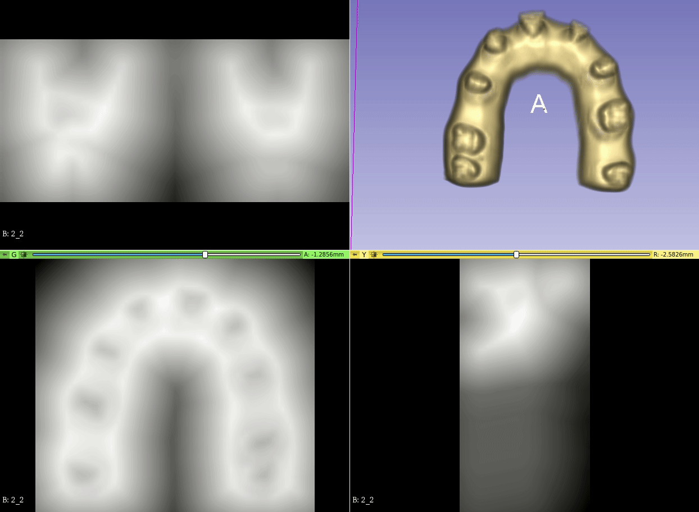
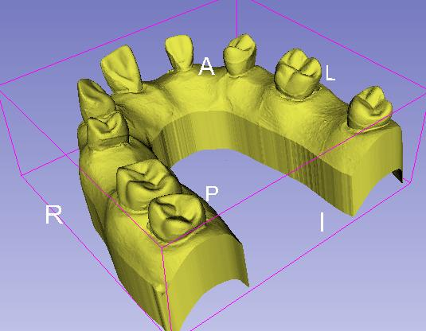
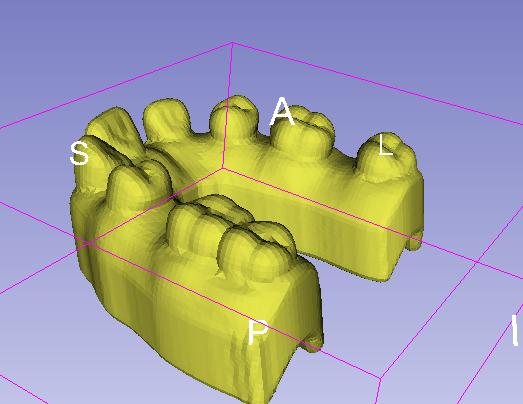
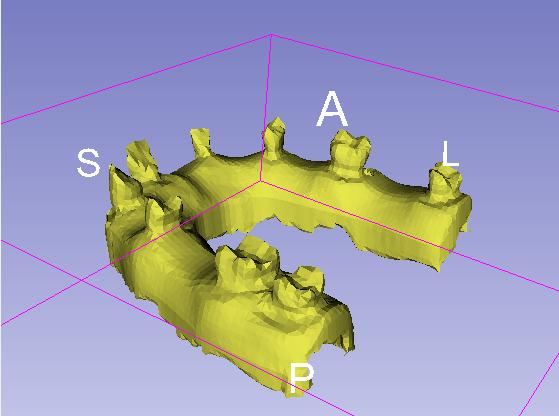

# MeshShrinkDilate
An application that converts a watertight mesh into a signed distance field(SDF), enabling precise dilation and shrinkage of the mesh.

original mesh

dilated mesh

shrinked mesh

## Usage
Start with either a watertight mesh in .stl format or a pre-generated SDF file in .nii.gz format.

The command-line arguments are structured as follows:

    ./Mesh2Sdf input_stl.stl(input stl file path, 0 for none)
               input_sdf.nii.gz(input SDF file path, 0 for none, useless if has input stl) 
               output_stl.stl(output stl file path, 0 for none) 
               output_sdf.nii.gz(output SDF file path, 0 for none) 
               0.0(mm, dilate value, postive for dilation and negtive for shrikage)
               1.0(mm, spacing of SDF, useless if has input SDF)
               1.0(mm, padding of SDF, useless if has input SDF) 
               0.0(0.0-1.0, mesh simplication rate, useless if has input SDF)

## Build
To build the project, VTK is required, and it is recommended to use version 9.0.3 or higher.

You can find VTK at <https://github.com/Kitware/VTK>.

To build the project, simply run the following command:

    mkdir build
    cd build
    cmake -S .. -B .
    cmake --build

